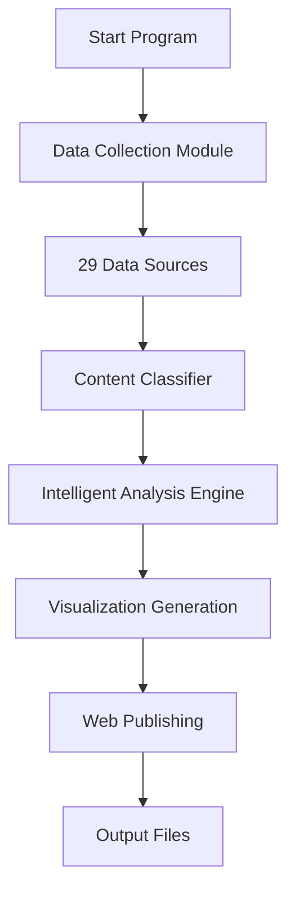

# 🌍 AI World Tracker

<p align="center">
  
  
  
  
  
  
</p>

<p align="center">
  <strong>Global AI Intelligence Tracking & Analysis System</strong><br>
  <em>全球人工智能资讯追踪与分析系统</em>
</p>

---

## 📋 Project Overview

AI World Tracker is a modern artificial intelligence information tracking system that automatically collects, classifies, analyzes, and visualizes AI-related information from around the world. The system integrates 29 high-quality data sources to provide real-time AI industry dynamics tracking and trend analysis.

### 🎯 Core Features

- **🌐 Global Data Sources**: Integrates 29 data sources including arXiv, GitHub, and mainstream tech media
- **🤖 Intelligent Classification**: Automatically identifies 6 dimensions: research, products, market, and development
- **📊 Real-time Analysis**: Generates visualization charts and trend reports
- **🌍 Web Dashboard**: Responsive HTML interface supporting multi-device access
- **🔄 Incremental Updates**: Supports historical data management and deduplication

## ⭐ Feature Highlights

### 📊 Data Collection (29 High-Quality Sources)

| Category | Data Sources | Description |
|----------|-------------|-------------|
| **🎓 Academic Research** | arXiv (4 categories) | Latest papers in AI/ML/CV/NLP |
| **💻 Developer** | GitHub, Hugging Face | Open source projects, model updates |
| **📰 Industry News** | TechCrunch, Wired, MIT Tech Review | International tech media |
| **🇨🇳 Chinese Content** | 36氪, 机器之心, 量子位 | Chinese AI industry news |
| **🚀 Product Launches** | Company official blogs | OpenAI, Google, Microsoft |
| **👥 Community** | Hacker News, Product Hunt | High-quality tech community content |

### 🔍 Intelligent Analysis Engine

#### Multi-dimensional Content Classification
- **📚 Research Dimension**: Academic papers, algorithmic breakthroughs
- **💼 Product Dimension**: New product releases, version updates
- **📈 Market Dimension**: Investments, policies and regulations
- **👨‍💻 Development Dimension**: Open source projects, development tools
- **🗣️ Leadership Dimension**: Industry expert opinions
- **💬 Community Dimension**: Community discussions, user feedback

#### Technical Domain Recognition
- **🤖 Generative AI**: LLM, GPT, Diffusion Models
- **👁️ Computer Vision**: Image recognition, video analysis
- **🗣️ NLP**: Natural language processing
- **🎮 Reinforcement Learning**: Deep reinforcement learning
- **⚙️ MLOps**: Machine learning operations
- **🛡️ AI Ethics**: AI ethics and safety

### 📊 Visualization & Reports

- **📈 Trend Charts**: Technology hotspots, content distribution, regional analysis
- **🌐 Web Dashboard**: Responsive HTML interface
- **📱 Mobile Adaptation**: Supports phone and tablet access
- **📄 Text Reports**: Detailed analysis reports
- **💾 Data Export**: Raw data in JSON format

## 🚀 Quick Start

### 📋 Requirements

- **Python**: 3.8+ 
- **Operating System**: Windows / Linux / macOS
- **Memory**: Recommended 2GB+
- **Network**: Stable internet connection

### ⚡ One-Click Installation (Recommended)

**Windows Users:**
```powershell
# Clone the project
git clone https://github.com/yourusername/ai-world-tracker.git
cd ai-world-tracker

# Run auto-installation script
.\install.ps1
```

**Linux/macOS Users:**
```bash
# Clone the project
git clone https://github.com/legendz_microsoft/ai-world-tracker.git
cd ai-world-tracker

# Install dependencies
pip install -r requirements.txt

# Run the program
python TheWorldOfAI.py
```

### 🔧 Manual Installation

```bash
# 1. Install Python dependencies
pip install -r requirements.txt

# 2. Verify installation
python -c "import requests, feedparser, arxiv; print('✅ Dependencies installed successfully')"

# 3. Run the program
python TheWorldOfAI.py
```

### 🎮 Usage

#### Method 1: Interactive Menu (Recommended for beginners)
```bash
python TheWorldOfAI.py
```

Interactive menu provides the following options:
- **🚀 One-click Update**: Complete data collection→analysis→visualization workflow
- **📊 View Reports**: Display latest AI trend analysis
- **🔍 Data Filtering**: Filter by type, region, technical domain
- **🌐 Generate Web**: Create HTML dashboard

#### Method 2: Command Line Mode (For automation)
```bash
# Auto-run complete workflow
python TheWorldOfAI.py --auto

# Show help information
python TheWorldOfAI.py --help
```

### 📂 Output Files

After running, the following files will be generated in the project directory:

```
📁 Output Files/
├── 📊 visualizations/          # Chart files
│   ├── tech_hotspots.png      # Technology hotspots chart
│   ├── content_distribution.png # Content distribution chart
│   └── daily_trends.png       # Trend analysis chart
├── 🌐 web_output/             # Web dashboard
│   └── ai_world_tracker.html  # HTML page ready to open
├── 💾 ai_tracker_data_*.json  # Raw data
└── 📄 ai_tracker_report_*.txt # Analysis reports
```

## 🏗️ Project Architecture

```
ai-world-tracker/
├── 🎯 Core Modules/
│   ├── TheWorldOfAI.py         # Main program entry
│   ├── data_collector.py       # Data collection engine
│   ├── content_classifier.py   # Intelligent classification system
│   ├── ai_analyzer.py          # Trend analysis engine
│   ├── visualizer.py           # Chart generator
│   └── web_publisher.py        # Web publisher
├── 🔧 Tools/
│   ├── link_validator.py       # Link validation tool
│   ├── diagnose_feeds.py       # Data source diagnosis
│   └── install.ps1             # Auto-installation script
├── 📖 Documentation/
│   ├── README.md               # Project documentation
│   ├── USAGE_GUIDE.md          # Usage guide
│   └── requirements.txt        # Dependencies list
└── 📁 Output Directories/
    ├── visualizations/         # Chart output (auto-created)
    └── web_output/            # Web output (auto-created)
```

### 🔄 Workflow



## 📊 Feature Demonstration

### 🖥️ Web Dashboard Preview

The generated web interface includes:
- **📊 Real-time Data Overview**: Shows latest collected AI news count and distribution
- **🔥 Technology Hotspots**: Most popular AI technology domains currently
- **🌍 Regional Analysis**: Geographic distribution of global AI activities
- **📈 Trend Charts**: Visualized data analysis results
- **📋 Detailed Lists**: Expandable complete data tables

### 💻 Terminal Interface

```bash
============================================================
📋 Main Menu
============================================================
1. 🚀 One-click Update Data & Reports (Update & Generate All)
2. 📄 View Analysis Report (View Report)
3. 🔍 Search & Filter (Search & Filter)
4. 🌐 Generate & Open Web Page (Generate & Open Web Page)
0. Exit Program
============================================================
Please select function (0-4):
```

## ⚙️ Advanced Configuration

### 🔧 Custom Data Sources

You can customize RSS feeds in `data_collector.py`:

```python
# Add new RSS source
self.rss_feeds['custom'] = [
    'https://your-custom-feed.xml'
]
```

### 🎯 Filter Configuration

Supports multi-dimensional data filtering:
- **Content Type**: research, product, market, developer, leader, community
- **Technical Domain**: Generative AI, Computer Vision, NLP, Reinforcement Learning
- **Regional Distribution**: China, USA, Europe, Global
- **Time Range**: Default 30 days, customizable

### 🔍 Data Quality Control

- **Timeliness**: Only collects latest content within 30 days
- **Relevance**: Automatically filters AI-related content based on keywords
- **Deduplication**: Intelligently identifies and removes duplicate content
- **Quality Score**: Automatic scoring based on source weight and content quality

## 🛠️ Troubleshooting

### Common Issues

**❌ Issue: Module import failed**
```bash
# Solution: Confirm you're in the correct directory and reinstall dependencies
pip install -r requirements.txt
```

**❌ Issue: Chinese character garbled in charts**
```bash
# Windows: Ensure Chinese fonts are installed
# Linux: sudo apt-get install fonts-wqy-microhei
# macOS: Built-in Chinese font support
```

**❌ Issue: Network connection timeout**
```bash
# Solution: Check network connection, some APIs have rate limits
# System will automatically use backup data sources
```

**❌ Issue: GitHub API limitations**
```bash
# System will automatically downgrade to sample data
# Or set GITHUB_TOKEN environment variable to increase access limits
```

### 🔧 Diagnostic Tools

The project provides built-in diagnostic tools:
```bash
# Check all data source status
python diagnose_feeds.py

# Verify network connections
python link_validator.py
```

## 📈 Development Roadmap

### 🎯 Coming Soon
- [ ] **Database Support**: Integrate SQLite persistent storage
- [ ] **API Interface**: RESTful API for data queries
- [ ] **Docker Deployment**: Containerized deployment solution
- [ ] **Scheduled Tasks**: Automatic timed collection and updates

### 🔮 Future Plans
- [ ] **Machine Learning**: Integrate NLP models for content summarization
- [ ] **Multi-language**: Support English, Chinese, Japanese interfaces
- [ ] **User System**: Personalized subscriptions and recommendations
- [ ] **Mobile App**: React Native mobile application
- [ ] **Real-time Notifications**: Real-time push for important AI updates

## 📊 Usage Examples

### Interactive Menu
```
============================================================
📋 Main Menu
============================================================
1. Run complete data processing workflow
2. Data collection only
3. View data statistics
4. Generate visualization charts
5. View analysis reports
6. Filter data by conditions
7. Generate Web page 🆕
0. Exit program
============================================================
```

### Filtering Features
- Filter by content type: research/product/market
- Filter by region: China/USA/Europe/Global
- Filter by technical domain: NLP, Computer Vision, etc.

## 🎯 Output Files

After running the program, the following files will be generated:

1. **JSON Data File**: `ai_tracker_data_YYYYMMDD_HHMMSS.json`
   - Contains all collected and classified raw data

2. **Analysis Report**: `ai_tracker_report_YYYYMMDD_HHMMSS.txt`
   - Text format trend analysis report

3. **Visualization Charts** (saved in `visualizations/` directory):
   - `tech_hotspots.png` - Technology hotspots chart
   - `content_distribution.png` - Content distribution chart
   - `region_distribution.png` - Regional distribution chart
   - `daily_trends.png` - Daily trends chart
   - `dashboard.png` - Comprehensive dashboard

4. **Web Page** 🆕 (saved in `web_output/` directory):
   - `ai_world_tracker.html` - Complete web page with all data and charts

## ⚙️ Configuration Options

### OpenAI API (Optional)
If you have an OpenAI API key, you can enable AI summary feature:

1. Set environment variable:
```powershell
$env:OPENAI_API_KEY = "your-api-key-here"
```

## 🤝 Contributing

We welcome all forms of contributions! Whether you're a developer, researcher, or AI enthusiast.

### 🔧 Ways to Contribute

**🐛 Report Issues**
- Submit bug reports in GitHub Issues
- Provide detailed reproduction steps and environment information

**💡 Feature Suggestions**
- Submit suggestions and ideas for new features
- Discuss technical implementation approaches

**📝 Code Contributions**
- Fork the project and create a feature branch
- Follow existing code style and comment conventions
- Test your changes before submitting a Pull Request

**📚 Documentation Improvements**
- Improve README, usage guides, and other documentation
- Add more usage examples and best practices

### 🚀 Development Environment Setup

```bash
# 1. Fork and clone the project
git clone https://github.com/yourusername/ai-world-tracker.git
cd ai-world-tracker

# 2. Create virtual environment
python -m venv venv
source venv/bin/activate  # Linux/macOS
# or venv\Scripts\activate.bat  # Windows

# 3. Install development dependencies
pip install -r requirements.txt
pip install pytest black flake8  # Development tools

# 4. Run tests
python -m pytest tests/

# 5. Code formatting
black . && flake8 .
```

## 📄 License

```
MIT License

Copyright (c) 2025 AI World Tracker Team

Permission is hereby granted, free of charge, to any person obtaining a copy
of this software and associated documentation files (the "Software"), to deal
in the Software without restriction, including without limitation the rights
to use, copy, modify, merge, publish, distribute, sublicense, and/or sell
copies of the Software, and to permit persons to whom the Software is
furnished to do so, subject to the following conditions:

The above copyright notice and this permission notice shall be included in all
copies or substantial portions of the Software.

THE SOFTWARE IS PROVIDED "AS IS", WITHOUT WARRANTY OF ANY KIND, EXPRESS OR
IMPLIED, INCLUDING BUT NOT LIMITED TO THE WARRANTIES OF MERCHANTABILITY,
FITNESS FOR A PARTICULAR PURPOSE AND NONINFRINGEMENT. IN NO EVENT SHALL THE
AUTHORS OR COPYRIGHT HOLDERS BE LIABLE FOR ANY CLAIM, DAMAGES OR OTHER
LIABILITY, WHETHER IN AN ACTION OF CONTRACT, TORT OR OTHERWISE, ARISING FROM,
OUT OF OR IN CONNECTION WITH THE SOFTWARE OR THE USE OR OTHER DEALINGS IN THE
SOFTWARE.
```

## 🙏 Acknowledgments

Thanks to the following open source projects and data source providers:
- [arXiv](https://arxiv.org/) - Academic paper data
- [GitHub](https://github.com/) - Open source project information
- [Hacker News](https://news.ycombinator.com/) - Tech community discussions
- [Product Hunt](https://www.producthunt.com/) - Product discovery platform
- RSS support from major tech media and company blogs

## 🌟 Star History

[](https://star-history.com/#legendz_microsoft/ai-world-tracker&Date)

---

<p align="center">
  <b>🚀 Let's track the future of AI together!</b><br>
  <i>Made with ❤️ by AI World Tracker Team</i>
</p>

<p align="center">
  <a href="#-ai-world-tracker">Back to Top ⬆️</a>
</p>
