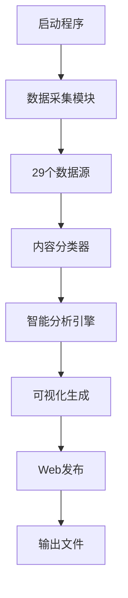

# 🌍 AI World Tracker

<p align="center">
  
  
  
  
</p>

<p align="center">
  <strong>全球人工智能资讯追踪与分析系统</strong><br>
  <em>Global AI Intelligence Tracking & Analysis System</em>
</p>

---

## 📋 项目概述

AI World Tracker 是一个现代化的人工智能资讯追踪系统，能够自动采集、分类、分析和可视化来自全球的AI相关信息。系统集成了29个高质量数据源，提供实时AI行业动态追踪和趋势分析。

### 🎯 核心特性

- **🌐 全球数据源**: 集成arXiv、GitHub、主流科技媒体等29个数据源
- **🤖 智能分类**: 自动识别研究、产品、市场、开发者等6个维度
- **📊 实时分析**: 生成可视化图表和趋势报告
- **🌍 Web仪表盘**: 响应式HTML界面，支持多设备访问
- **🔄 增量更新**: 支持历史数据管理和去重机制

## ⭐ 功能特性

### 📊 数据采集 (29个高质量数据源)

| 类别 | 数据源 | 说明 |
|------|--------|------|
| **🎓 学术研究** | arXiv (4个分类) | AI/ML/CV/NLP最新论文 |
| **💻 开发者** | GitHub, Hugging Face | 开源项目、模型动态 |
| **📰 行业新闻** | TechCrunch, Wired, MIT Tech Review | 国际科技媒体 |
| **🇨🇳 中文资讯** | 36氪, 机器之心, 量子位 | 中国AI行业动态 |
| **🚀 产品发布** | 各大公司官方博客 | OpenAI, Google, Microsoft |
| **👥 社区讨论** | Hacker News, Product Hunt | 技术社区高质量内容 |

### 🔍 智能分析引擎

#### 多维度内容分类
- **📚 研究维度**: 学术论文、算法突破
- **💼 产品维度**: 新产品发布、版本更新  
- **📈 市场维度**: 投融资、政策法规
- **👨‍💻 开发维度**: 开源项目、开发工具
- **🗣️ 领袖维度**: 行业专家观点
- **💬 社区维度**: 社区讨论、用户反馈

#### 技术领域识别
- **🤖 Generative AI**: LLM, GPT, Diffusion Models
- **👁️ Computer Vision**: 图像识别、视频分析
- **🗣️ NLP**: 自然语言处理
- **🎮 Reinforcement Learning**: 强化学习
- **⚙️ MLOps**: 机器学习运维
- **🛡️ AI Ethics**: AI伦理与安全

### 📊 可视化与报告

- **📈 趋势图表**: 技术热点、内容分布、地区分析
- **🌐 Web仪表盘**: 响应式HTML界面
- **📱 移动适配**: 支持手机、平板访问
- **📄 文本报告**: 详细的分析报告
- **💾 数据导出**: JSON格式的原始数据

## 🚀 快速开始

### 📋 环境要求

- **Python**: 3.8+ 
- **操作系统**: Windows / Linux / macOS
- **内存**: 建议 2GB+
- **网络**: 稳定的互联网连接

### ⚡ 一键安装 (推荐)

**Windows 用户:**
```powershell
# 克隆项目
git clone https://github.com/yourusername/ai-world-tracker.git
cd ai-world-tracker

# 运行自动安装脚本
.\install.ps1
```

**Linux/macOS 用户:**
```bash
# 克隆项目
git clone https://github.com/yourusername/ai-world-tracker.git
cd ai-world-tracker

# 安装依赖
pip install -r requirements.txt

# 运行程序
python TheWorldOfAI.py
```

### 🔧 手动安装

```bash
# 1. 安装Python依赖
pip install -r requirements.txt

# 2. 验证安装
python -c "import requests, feedparser, arxiv; print('✅ 依赖安装成功')"

# 3. 运行程序
python TheWorldOfAI.py
```

### 🎮 使用方式

#### 方式一: 交互式菜单 (推荐新手)
```bash
python TheWorldOfAI.py
```

交互菜单提供以下选项:
- **🚀 一键更新**: 完整的数据采集→分析→可视化流程
- **📊 查看报告**: 展示最新的AI趋势分析  
- **🔍 数据筛选**: 按类型、地区、技术领域筛选
- **🌐 生成网页**: 创建HTML仪表盘

#### 方式二: 命令行模式 (适合自动化)
```bash
# 自动运行完整流程
python TheWorldOfAI.py --auto

# 显示帮助信息  
python TheWorldOfAI.py --help
```

### 📂 输出文件

运行后会在项目目录生成:

```
📁 输出文件/
├── 📊 visualizations/          # 图表文件
│   ├── tech_hotspots.png      # 技术热点图
│   ├── content_distribution.png # 内容分布图
│   └── daily_trends.png       # 趋势分析图
├── 🌐 web_output/             # Web仪表盘
│   └── ai_world_tracker.html  # 可直接打开的网页
├── 💾 ai_tracker_data_*.json  # 原始数据
└── 📄 ai_tracker_report_*.txt # 分析报告
```

## 🏗️ 项目架构

```
ai-world-tracker/
├── 🎯 Core Modules/
│   ├── TheWorldOfAI.py         # 主程序入口
│   ├── data_collector.py       # 数据采集引擎
│   ├── content_classifier.py   # 智能分类系统  
│   ├── ai_analyzer.py          # 趋势分析引擎
│   ├── visualizer.py           # 图表生成器
│   └── web_publisher.py        # Web发布器
├── 🔧 Tools/
│   ├── link_validator.py       # 链接验证工具
│   ├── diagnose_feeds.py       # 数据源诊断
│   └── install.ps1             # 自动安装脚本
├── 📖 Documentation/
│   ├── README.md               # 项目说明
│   ├── USAGE_GUIDE.md          # 使用指南
│   └── requirements.txt        # 依赖清单
└── 📁 Output Directories/
    ├── visualizations/         # 图表输出 (自动创建)
    └── web_output/            # 网页输出 (自动创建)
```

### 🔄 工作流程



## 📊 功能演示

### 🖥️ Web仪表盘预览

生成的Web界面包含:
- **📊 实时数据概览**: 显示最新采集的AI资讯数量和分布
- **🔥 技术热点**: 当前最受关注的AI技术领域
- **🌍 地区分析**: 全球AI活动的地理分布
- **📈 趋势图表**: 可视化的数据分析结果
- **📋 详细列表**: 可展开的完整数据表格

### 💻 终端界面

```bash
============================================================
📋 主菜单  
============================================================
1. 🚀 一键更新数据与报告 (Update & Generate All)
2. 📄 查看分析报告 (View Report) 
3. 🔍 搜索与筛选 (Search & Filter)
4. 🌐 生成并打开 Web 页面 (Generate & Open Web Page)
0. 退出程序
============================================================
请选择功能 (0-4): 
```

## ⚙️ 高级配置

### 🔧 自定义数据源

您可以在 `data_collector.py` 中自定义RSS源:

```python
# 添加新的RSS源
self.rss_feeds['custom'] = [
    'https://your-custom-feed.xml'
]
```

### 🎯 筛选配置

支持多维度数据筛选:
- **内容类型**: research, product, market, developer, leader, community
- **技术领域**: Generative AI, Computer Vision, NLP, Reinforcement Learning
- **地区分布**: China, USA, Europe, Global
- **时间范围**: 默认30天内，可自定义

### 🔍 数据质量控制

- **时效性**: 仅采集30天内的最新内容
- **相关性**: 基于关键词自动过滤AI相关内容  
- **去重机制**: 智能识别并移除重复内容
- **质量评分**: 基于来源权重和内容质量自动评分

## 🛠️ 故障排除

### 常见问题

**❌ 问题: 模块导入失败**
```bash
# 解决方案: 确认在正确目录并重新安装依赖
pip install -r requirements.txt
```

**❌ 问题: 图表显示中文乱码**
```bash
# Windows: 确保安装中文字体
# Linux: sudo apt-get install fonts-wqy-microhei  
# macOS: 系统自带中文字体支持
```

**❌ 问题: 网络连接超时**
```bash
# 解决方案: 检查网络连接，部分API有访问频率限制
# 系统会自动使用备用数据源
```

**❌ 问题: GitHub API限制**  
```bash
# 系统会自动降级到示例数据
# 或设置 GITHUB_TOKEN 环境变量提高访问限额
```

### 🔧 诊断工具

项目提供了内置诊断工具:
```bash
# 检测所有数据源状态
python diagnose_feeds.py

# 验证网络连接
python link_validator.py
```

## 📈 开发路线图

### 🎯 即将发布
- [ ] **数据库支持**: 集成SQLite持久化存储
- [ ] **API接口**: RESTful API用于数据查询
- [ ] **Docker部署**: 容器化部署方案
- [ ] **定时任务**: 自动定时采集和更新

### 🔮 未来规划  
- [ ] **机器学习**: 集成NLP模型进行内容摘要
- [ ] **多语言**: 支持英文、中文、日文界面
- [ ] **用户系统**: 个性化订阅和推荐
- [ ] **移动App**: React Native移动端应用
- [ ] **实时通知**: 重要AI动态实时推送

## 📊 使用示例

### 交互式菜单
```
============================================================
📋 主菜单
============================================================
1. 运行完整数据处理流程
2. 仅采集数据
3. 查看数据统计
4. 生成可视化图表
5. 查看分析报告
6. 按条件筛选数据
7. 生成Web页面 🆕
0. 退出程序
============================================================
```

### 筛选功能
- 按内容类型筛选: research/product/market
- 按地区筛选: China/USA/Europe/Global
- 按技术领域筛选: NLP, Computer Vision等

## 🎯 输出文件

程序运行后会生成以下文件:

1. **JSON数据文件**: `ai_tracker_data_YYYYMMDD_HHMMSS.json`
   - 包含所有采集和分类的原始数据

2. **分析报告**: `ai_tracker_report_YYYYMMDD_HHMMSS.txt`
   - 文本格式的趋势分析报告

3. **可视化图表** (保存在 `visualizations/` 目录):
   - `tech_hotspots.png` - 技术热点图
   - `content_distribution.png` - 内容分布图
   - `region_distribution.png` - 地区分布图
   - `daily_trends.png` - 每日趋势图
   - `dashboard.png` - 综合仪表板

4. **Web网页** 🆕 (保存在 `web_output/` 目录):
   - `ai_world_tracker.html` - 完整的Web页面，包含所有数据和图表

## ⚙️ 配置选项

### OpenAI API (可选)
如果你有OpenAI API密钥，可以启用AI摘要功能:

1. 设置环境变量:
```powershell
$env:OPENAI_API_KEY = "your-api-key-here"
```

## 🤝 贡献指南

我们欢迎所有形式的贡献！无论您是开发者、研究者还是AI爱好者。

### 🔧 贡献方式

**🐛 报告问题**
- 在GitHub Issues中提交bug报告
- 提供详细的复现步骤和环境信息

**💡 功能建议**  
- 提交新功能的建议和想法
- 讨论技术实现方案

**📝 代码贡献**
- Fork项目并创建feature分支
- 遵循现有的代码风格和注释规范
- 提交Pull Request前请测试您的修改

**📚 文档改进**
- 改进README、使用指南等文档
- 添加更多使用示例和最佳实践

### 🚀 开发环境设置

```bash
# 1. Fork并克隆项目
git clone https://github.com/yourusername/ai-world-tracker.git
cd ai-world-tracker

# 2. 创建虚拟环境
python -m venv venv
source venv/bin/activate  # Linux/macOS
# 或 venv\Scripts\activate.bat  # Windows

# 3. 安装开发依赖
pip install -r requirements.txt
pip install pytest black flake8  # 开发工具

# 4. 运行测试
python -m pytest tests/

# 5. 代码格式化
black . && flake8 .
```

## 📄 许可证

```
MIT License

Copyright (c) 2025 AI World Tracker Team

Permission is hereby granted, free of charge, to any person obtaining a copy
of this software and associated documentation files (the "Software"), to deal
in the Software without restriction, including without limitation the rights
to use, copy, modify, merge, publish, distribute, sublicense, and/or sell
copies of the Software, and to permit persons to whom the Software is
furnished to do so, subject to the following conditions:

The above copyright notice and this permission notice shall be included in all
copies or substantial portions of the Software.

THE SOFTWARE IS PROVIDED "AS IS", WITHOUT WARRANTY OF ANY KIND, EXPRESS OR
IMPLIED, INCLUDING BUT NOT LIMITED TO THE WARRANTIES OF MERCHANTABILITY,
FITNESS FOR A PARTICULAR PURPOSE AND NONINFRINGEMENT. IN NO EVENT SHALL THE
AUTHORS OR COPYRIGHT HOLDERS BE LIABLE FOR ANY CLAIM, DAMAGES OR OTHER
LIABILITY, WHETHER IN AN ACTION OF CONTRACT, TORT OR OTHERWISE, ARISING FROM,
OUT OF OR IN CONNECTION WITH THE SOFTWARE OR THE USE OR OTHER DEALINGS IN THE
SOFTWARE.
```

## 🙏 致谢

感谢以下开源项目和数据源提供商:
- [arXiv](https://arxiv.org/) - 学术论文数据
- [GitHub](https://github.com/) - 开源项目信息
- [Hacker News](https://news.ycombinator.com/) - 技术社区讨论
- [Product Hunt](https://www.producthunt.com/) - 产品发现平台
- 各大科技媒体和公司博客的RSS支持

## 🌟 Star History

[](https://star-history.com/#yourusername/ai-world-tracker&Date)

---

<p align="center">
  <b>🚀 让我们一起追踪AI的未来！</b><br>
  <i>Made with ❤️ by AI World Tracker Team</i>
</p>

<p align="center">
  <a href="#-ai-world-tracker">回到顶部 ⬆️</a>
</p>
