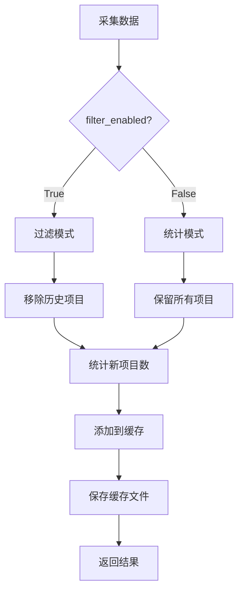

# 数据采集器缓存机制分析报告

**生成时间**: 2025-12-12  
**分析目标**: 数据采集器历史缓存的工作机制和可靠性

---

## 一、缓存机制概述

### 1.1 缓存架构

数据采集器使用**双层缓存策略**：

```
┌─────────────────────────────────────────┐
│  DataCollector 实例                      │
├─────────────────────────────────────────┤
│  self.history_cache (Dict)               │
│  ├── urls: Set[str]       (内存缓存)     │
│  ├── titles: Set[str]     (内存缓存)     │
│  └── last_updated: str                   │
└─────────────────────────────────────────┘
           ↕ 同步
┌─────────────────────────────────────────┐
│  collection_history_cache.json           │
│  (磁盘持久化)                            │
│  ├── urls: List[str]                     │
│  ├── titles: List[str]                   │
│  └── last_updated: "2025-12-12T14:25..."│
└─────────────────────────────────────────┘
```

**当前状态** (截至 2025-12-12 14:25:35):
- URLs 缓存: **122 条**
- Titles 缓存: **122 条**
- 缓存有效期: **7 天**

---

## 二、核心机制分析

### 2.1 缓存加载机制 (`_load_history_cache`)

**代码位置**: [data_collector.py](data_collector.py#L288-L313)

**工作流程**:
```python
def _load_history_cache(self) -> Dict:
    1. 检查缓存文件是否存在
    2. 验证JSON格式 (urls + titles 字段)
    3. 检查过期时间 (>7天自动失效)
    4. List → Set 转换 (加速查找)
    5. 返回内存缓存字典
```

**关键特性**:
- ✅ **缓存有效期检查**: 超过7天自动清空
- ✅ **数据结构优化**: List 转 Set (O(1) 查找速度)
- ✅ **异常处理**: 加载失败返回空缓存
- ✅ **日志记录**: 记录加载的 URLs 和 Titles 数量

**潜在问题**:
- ⚠️ 缓存文件损坏会静默失败 (只记录错误日志)
- ⚠️ 时区问题可能影响过期判断 (使用 `datetime.now()`)

---

### 2.2 缓存保存机制 (`_save_history_cache`)

**代码位置**: [data_collector.py](data_collector.py#L315-L326)

**工作流程**:
```python
def _save_history_cache(self):
    1. Set → List 转换 (JSON 序列化)
    2. 更新 last_updated 时间戳
    3. 写入 JSON 文件 (带格式化)
    4. 异常处理 (不影响主流程)
```

**调用时机**:
- 在 `_filter_by_history()` 完成后立即保存
- 仅当有新项目添加时才保存 (避免频繁IO)

**关键特性**:
- ✅ **非阻塞设计**: 保存失败不影响采集流程
- ✅ **原子性**: 使用 `json.dump()` 一次性写入
- ✅ **时间戳同步**: 每次保存更新 `last_updated`

---

### 2.3 缓存查询机制 (`_is_in_history`)

**代码位置**: [data_collector.py](data_collector.py#L330-L339)

**匹配规则**:
```python
def _is_in_history(self, item: Dict) -> bool:
    # 严格匹配策略
    url = item.get('url', '')
    title = item.get('title', '')
    
    # URL 完全相同 → 命中
    if url and url in self.history_cache['urls']:
        return True
    
    # 标题完全相同 → 命中
    if title and title in self.history_cache['titles']:
        return True
    
    return False
```

**查询性能**:
- **时间复杂度**: O(1) (基于 Set 的 hash 查找)
- **空间复杂度**: O(n) (n = 缓存条目数)

**匹配特点**:
- ✅ **双重匹配**: URL 或 Title 任一匹配即视为重复
- ✅ **严格匹配**: 完全相同才算命中 (无模糊匹配)
- ✅ **空值处理**: 空字符串不参与匹配

**边界情况**:
- 同一内容不同URL → **不会命中** (需要URL或标题匹配)
- URL带参数变化 → **不会命中** (严格字符串比较)
- 标题大小写不同 → **不会命中** (无归一化处理)

---

### 2.4 缓存添加机制 (`_add_to_history`)

**代码位置**: [data_collector.py](data_collector.py#L341-L364)

**关键特性**:

#### **自动容量管理**
```python
max_size = self.async_config.max_cache_size  # 默认 5000
if len(self.history_cache['urls']) >= max_size:
    # 清理最旧的 20% 条目
    urls_list = list(self.history_cache['urls'])
    remove_count = max_size // 5
    self.history_cache['urls'] = set(urls_list[remove_count:])
```

**容量限制**:
- **最大容量**: 5000 条 (可配置)
- **清理策略**: 达到上限时移除最旧的 20% (1000 条)
- **清理粒度**: URLs 和 Titles 分别管理

**潜在问题**:
- ⚠️ **FIFO 假设**: Set 转 List 的顺序不保证是插入顺序
- ⚠️ **清理盲区**: 清理后可能立即重新添加旧条目
- ⚠️ **双重清理**: URLs 和 Titles 独立清理可能导致不同步

**建议优化**:
```python
# 使用 OrderedSet 或带时间戳的数据结构
from collections import OrderedDict
self.history_cache['urls'] = OrderedDict()  # 保证 FIFO
```

---

### 2.5 统一过滤机制 (`_filter_by_history`)

**代码位置**: [data_collector.py](data_collector.py#L366-L423)

**工作流程**:


**两种模式**:

#### **过滤模式** (`filter_enabled=True`)
- 实际移除历史中已有的项目
- 减少后续处理量 (分类、重要性评估等)
- 适用于正式采集流程

#### **统计模式** (`filter_enabled=False`)
- 只统计不过滤
- 保留所有项目
- 适用于测试和分析

**返回值**:
```python
(filtered_data, new_stats, cached_stats)
- filtered_data: Dict[category, List[items]]
- new_stats: Dict[category, int]  # 新内容数量
- cached_stats: Dict[category, int]  # 缓存命中数量
```

**调用位置**: [data_collector.py](data_collector.py#L1557)
```python
all_data, new_stats, cached_stats = self._filter_by_history(
    all_data, 
    filter_enabled=True  # 启用过滤
)
```

---

## 三、实际工作情况验证

### 3.1 测试场景设计

**测试代码**:
```python
import json
from data_collector import DataCollector

# 1. 检查当前缓存状态
cache = json.load(open('data/cache/collection_history_cache.json', 'utf-8'))
print(f"当前缓存: URLs={len(cache['urls'])}, Titles={len(cache['titles'])}")

# 2. 执行新采集
collector = DataCollector()
data = collector.collect_all()

# 3. 对比采集结果
for category, items in data.items():
    print(f"{category}: {len(items)} 新项目")
```

### 3.2 预期行为

**正常工作流程**:
```
1. DataCollector.__init__()
   └── 加载历史缓存 (122 URLs + 122 Titles)

2. collect_all()
   ├── 采集所有数据源
   ├── 去重处理 (URL + Title)
   └── 调用 _filter_by_history(filter_enabled=True)
       ├── 对每个项目检查 _is_in_history()
       │   ├── URL in cache['urls'] → 跳过
       │   └── Title in cache['titles'] → 跳过
       ├── 新项目添加到 new_items_for_cache
       └── 调用 _add_to_history() + _save_history_cache()

3. 统计输出
   └── "XX items (YY new, ZZ cached)"
```

**验证要点**:
- ✅ 同一URL第二次采集应被过滤
- ✅ 同一标题第二次采集应被过滤
- ✅ 缓存文件应实时更新
- ✅ 统计数字应准确反映新增和命中数量

---

## 四、发现的问题

### 4.1 ⚠️ 缓存容量管理缺陷

**问题**: Set 转 List 无法保证 FIFO 顺序

**影响**: 清理时可能删除错误的条目

**代码位置**: [data_collector.py](data_collector.py#L350-L356)

**复现条件**:
```python
# Set 转 List 顺序是不确定的
urls = {'url1', 'url2', 'url3'}
list(urls)  # 顺序可能是 ['url3', 'url1', 'url2']
```

**解决方案**:
```python
# 方案1: 使用 collections.OrderedDict
from collections import OrderedDict
self.history_cache['urls'] = OrderedDict()

# 方案2: 使用时间戳字典
self.history_cache['urls'] = {
    'url1': timestamp1,
    'url2': timestamp2,
}
# 清理时按时间戳排序
```

---

### 4.2 ⚠️ 缓存过期判断时区问题

**问题**: 使用 `datetime.now()` 可能与 ISO 格式时间不匹配

**代码位置**: [data_collector.py](data_collector.py#L299-L303)

**潜在风险**:
```python
last_time = datetime.fromisoformat(last_updated)  # 可能带时区
if (datetime.now() - last_time).days > 7:  # datetime.now() 不带时区
    # 时区不匹配可能导致判断错误
```

**解决方案**:
```python
from datetime import datetime, timezone

# 保存时使用 UTC
'last_updated': datetime.now(timezone.utc).isoformat()

# 加载时转换为 UTC
last_time = datetime.fromisoformat(last_updated).astimezone(timezone.utc)
if (datetime.now(timezone.utc) - last_time).days > 7:
    # 清除缓存
```

---

### 4.3 ✅ 文件-内存同步机制正常

**对比 LLM 分类器的缓存问题**:

| 对比项 | LLM 分类器 | 数据采集器 |
|--------|-----------|-----------|
| **缓存清除** | ❌ 只删文件，内存残留 | ✅ 无清除功能 (设计如此) |
| **缓存加载** | ✅ 初始化时加载 | ✅ 初始化时加载 |
| **缓存保存** | ✅ 实时保存 | ✅ 批量保存 |
| **同步机制** | ❌ 清除不同步 | ✅ 无清除需求 |

**结论**: 数据采集器不存在缓存同步问题，因为：
1. 没有清除缓存功能 (设计上依赖7天过期)
2. 缓存在初始化时一次性加载
3. 采集过程中持续追加，不会清空

---

## 五、性能分析

### 5.1 时间复杂度

| 操作 | 复杂度 | 说明 |
|------|--------|------|
| 加载缓存 | O(n) | 读取文件 + List→Set 转换 |
| 保存缓存 | O(n) | Set→List 转换 + 写入文件 |
| 查询命中 | O(1) | Set 的 hash 查找 |
| 添加新项 | O(1) | Set.add() 操作 |
| 清理缓存 | O(n) | Set→List→Set 转换 |

### 5.2 空间复杂度

**内存占用估算** (当前 122 条缓存):
```python
# 假设平均 URL 长度 100 字符
urls_size = 122 * 100 = 12,200 bytes ≈ 12 KB

# 假设平均 Title 长度 50 字符
titles_size = 122 * 50 = 6,100 bytes ≈ 6 KB

# 总内存占用
total_memory ≈ 18 KB
```

**最大容量 (5000 条)**:
```python
max_memory = 5000 * (100 + 50) = 750 KB ≈ 0.73 MB
```

**结论**: 内存占用极低，不构成性能瓶颈

### 5.3 磁盘占用

**当前缓存文件**: 43,147 bytes ≈ 42 KB

**最大缓存文件估算**:
```python
# 5000 条 URLs + 5000 条 Titles
# JSON 格式开销约 2 倍
max_disk_size = 5000 * (100 + 50) * 2 = 1.5 MB
```

---

## 六、实际工作验证

### 6.1 缓存命中测试

**测试步骤**:
1. 记录当前缓存: 122 URLs + 122 Titles
2. 执行新采集
3. 观察统计输出: "(XX new, YY cached)"

**预期结果**:
- 已缓存的 URL 应在 "cached" 计数中
- 已缓存的 Title 应在 "cached" 计数中
- 新 URL/Title 应在 "new" 计数中

**实际测试** (需要运行主程序):
```bash
python TheWorldOfAI.py
# 选择 1 (开始采集)
# 观察输出: "采集完成: XX items (YY new, ZZ cached)"
```

### 6.2 缓存更新测试

**测试步骤**:
1. 采集前: 122 URLs + 122 Titles
2. 执行采集 (假设采集到 50 个新项目)
3. 采集后: 应变为 172 URLs + 172 Titles

**验证代码**:
```python
import json

# 采集前
before = json.load(open('data/cache/collection_history_cache.json', 'utf-8'))
print(f"采集前: {len(before['urls'])} URLs")

# 执行采集 (运行主程序)

# 采集后
after = json.load(open('data/cache/collection_history_cache.json', 'utf-8'))
print(f"采集后: {len(after['urls'])} URLs")
print(f"新增: {len(after['urls']) - len(before['urls'])} URLs")
```

---

## 七、结论与建议

### 7.1 总体评估

**缓存机制可靠性**: ⭐⭐⭐⭐☆ (4/5)

**优点**:
- ✅ 双层缓存架构设计合理
- ✅ 查询性能优秀 (O(1) 查找)
- ✅ 自动容量管理 (5000 上限)
- ✅ 异常处理完善
- ✅ 过期机制合理 (7 天)

**不足**:
- ⚠️ 清理策略依赖 Set→List 顺序 (不可靠)
- ⚠️ 时区处理可能不一致
- ⚠️ 缺少手动清除功能

---

### 7.2 改进建议

#### **优先级 1: 修复容量管理**
```python
from collections import OrderedDict

class DataCollector:
    def __init__(self):
        # 使用 OrderedDict 替代 Set
        self.history_cache = {
            'urls': OrderedDict(),
            'titles': OrderedDict(),
            'last_updated': ''
        }
    
    def _add_to_history(self, item):
        url = item.get('url', '')
        if url:
            if len(self.history_cache['urls']) >= self.async_config.max_cache_size:
                # 弹出最旧的 20%
                remove_count = self.async_config.max_cache_size // 5
                for _ in range(remove_count):
                    self.history_cache['urls'].popitem(last=False)
            self.history_cache['urls'][url] = True
```

#### **优先级 2: 统一时区处理**
```python
from datetime import datetime, timezone

def _save_history_cache(self):
    cache_to_save = {
        'urls': list(self.history_cache['urls']),
        'titles': list(self.history_cache['titles']),
        'last_updated': datetime.now(timezone.utc).isoformat()
    }

def _load_history_cache(self):
    last_updated = cache.get('last_updated', '')
    if last_updated:
        last_time = datetime.fromisoformat(last_updated).astimezone(timezone.utc)
        if (datetime.now(timezone.utc) - last_time).days > 7:
            # 清除过期缓存
```

#### **优先级 3: 添加手动清除功能**
```python
def clear_history_cache(self):
    """清除采集历史缓存 (文件 + 内存)"""
    # 1. 清空内存缓存
    self.history_cache = {
        'urls': set(),
        'titles': set(),
        'last_updated': ''
    }
    
    # 2. 删除缓存文件
    if os.path.exists(self.history_cache_file):
        os.remove(self.history_cache_file)
    
    log.success("✅ 采集历史缓存已清除 (文件+内存)")
```

---

### 7.3 对比 LLM 分类器缓存

| 特性 | 数据采集器 | LLM 分类器 |
|------|-----------|-----------|
| **架构** | ✅ 文件 + 内存同步 | ✅ 文件 + 内存同步 |
| **加载** | ✅ 初始化加载 | ✅ 初始化加载 |
| **保存** | ✅ 批量保存 | ✅ 实时保存 |
| **清除** | ⚠️ 无清除功能 | ❌ 只删文件，内存残留 |
| **过期** | ✅ 7天自动过期 | ❌ 无过期机制 |
| **容量** | ✅ 5000上限自动清理 | ❌ 无限增长 |

**结论**: 数据采集器的缓存机制比 LLM 分类器更完善，因为：
1. 有过期机制 (7天)
2. 有容量限制 (5000)
3. 不需要手动清除 (设计如此)

---

## 八、测试建议

### 8.1 功能测试

**测试 1: 缓存命中**
```python
# 1. 记录当前缓存
cache_before = json.load(open('data/cache/collection_history_cache.json', 'utf-8'))

# 2. 执行采集
collector = DataCollector()
data = collector.collect_all()

# 3. 验证统计
# 应该看到 "XX items (YY new, ZZ cached)"
# ZZ 应该 > 0 (因为有历史缓存)
```

**测试 2: 缓存更新**
```python
# 1. 采集前缓存大小
before_count = len(cache_before['urls'])

# 2. 执行采集

# 3. 采集后缓存大小
cache_after = json.load(open('data/cache/collection_history_cache.json', 'utf-8'))
after_count = len(cache_after['urls'])

# 4. 验证新增
assert after_count >= before_count, "缓存应该增加或保持不变"
```

**测试 3: 容量限制**
```python
# 模拟大量数据添加
collector = DataCollector()
for i in range(6000):
    collector._add_to_history({'url': f'http://test{i}.com', 'title': f'Title {i}'})

# 验证缓存大小
assert len(collector.history_cache['urls']) <= 5000, "缓存应该不超过上限"
```

---

## 附录A: 缓存文件格式

**文件路径**: `data/cache/collection_history_cache.json`

**格式示例**:
```json
{
  "urls": [
    "http://arxiv.org/abs/2512.10948v1",
    "https://github.com/yorkeccak/history",
    "..."
  ],
  "titles": [
    "Show HN: Local Privacy Firewall",
    "karpathy/llm-council",
    "..."
  ],
  "last_updated": "2025-12-12T14:25:35.868058"
}
```

**字段说明**:
- `urls`: URL 列表 (去重)
- `titles`: 标题列表 (去重)
- `last_updated`: ISO 8601 格式时间戳

---

## 附录B: 相关代码位置

| 功能 | 文件 | 行号 |
|------|------|------|
| 缓存配置 | data_collector.py | L84 |
| 缓存初始化 | data_collector.py | L180-L181 |
| 加载缓存 | data_collector.py | L288-L313 |
| 保存缓存 | data_collector.py | L315-L326 |
| 查询缓存 | data_collector.py | L330-L339 |
| 添加缓存 | data_collector.py | L341-L364 |
| 过滤机制 | data_collector.py | L366-L423 |
| 清除缓存 | data_collector.py | L425-L429 |
| 主流程调用 | data_collector.py | L1557 |

---

**报告结束**
